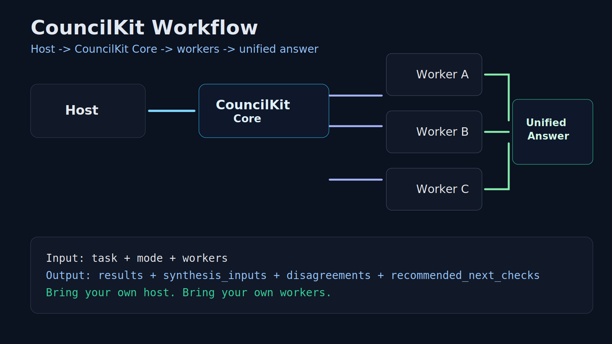
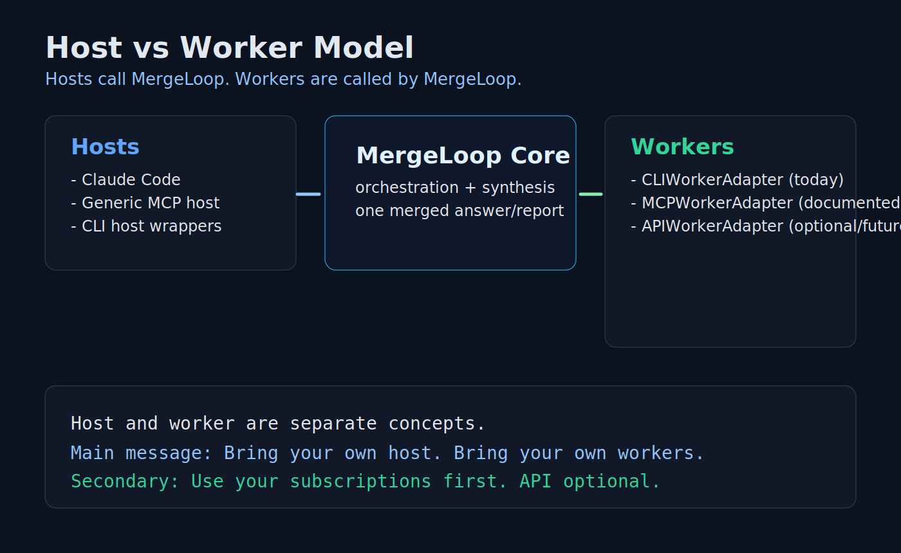
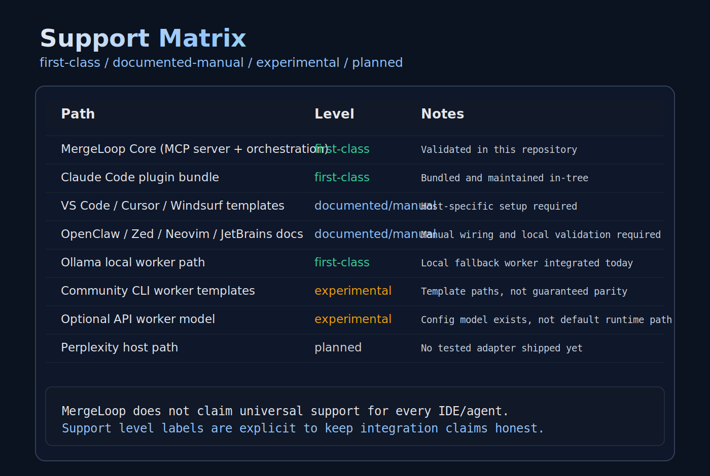
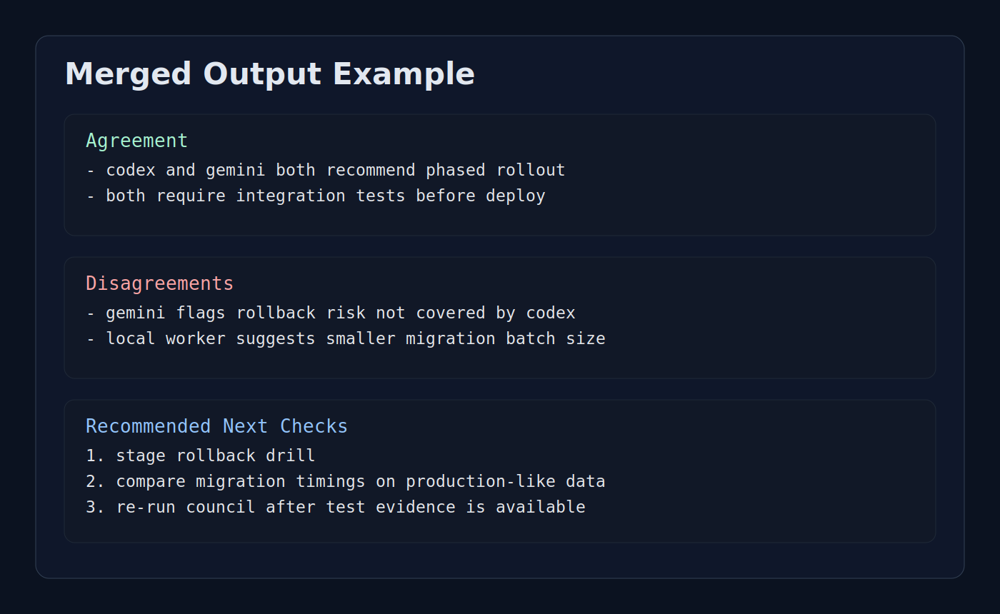

# CouncilKit


## One prompt. Many models. One answer.

CouncilKit is a host-agnostic model council that routes work across MCP, CLI, and optional API workers, then returns one unified answer.

**Bring your own host. Bring your own workers. CouncilKit returns one answer.**  
**Use your subscriptions first. API optional.**

## How It Works

1. A host sends one task to `council_run`.
2. CouncilKit routes the task to selected workers.
3. Workers run in `single` or `council` mode.
4. CouncilKit returns one merged report:
   `results`, `synthesis_inputs`, `disagreements`, `recommended_next_checks`.

## Hosts vs Workers

- **Host**: user entrypoint (Claude Code, generic MCP host, CLI host wrappers, Daena add-on host path).
- **Worker**: execution target CouncilKit calls (CLI workers today, MCP/API worker patterns documented).
- **CouncilKit Core**: orchestration middle layer between host and workers.

See architecture visual: [docs/demo/host-worker-model.svg](./docs/demo/host-worker-model.svg)
Detailed architecture notes: [docs/architecture.md](./docs/architecture.md)

## Supported Today / Experimental / Planned

### Supported Today

- CouncilKit core runtime (`council-hub` MCP stdio server)
- Claude Code plugin bundle in this repo
- CLI workers (`codex`, `gemini`, `local`, `custom_workers`)
- Documented host templates for VS Code, Cursor, Windsurf, OpenClaw, Zed, Neovim, JetBrains

### Experimental

- Antigravity via custom CLI worker path
- API worker config model (documented config path, not first-class runtime adapter yet)

### Planned

- Additional first-class host adapters beyond current bundle
- Hardened API worker adapter implementation
- Future host targets (including Perplexity) only when a real, tested adapter exists

## Use Your Subscriptions First

CouncilKit is built for local, subscription-first orchestration.  
If API adapters are needed later, they are optional extensions, not the core requirement.

## Install

### Base Install (all platforms)

```bash
npm ci
npm test
npm run build
npm run smoke
```

Run environment checks:

```bash
npm run doctor
```

If `doctor` fails only on missing external CLIs, install/auth those CLIs or disable them in config.

### Claude Code Host

```bash
claude --plugin-dir ./councilkit
```

Uses:
- [`.claude-plugin/plugin.json`](./.claude-plugin/plugin.json)
- [`.mcp.json`](./.mcp.json)
- [`skills/run/SKILL.md`](./skills/run/SKILL.md)

### Codex as Host Path

- Use CouncilKit as a standalone MCP server:
  `node ./dist/server.js`
- Invoke `council_run` from your Codex host flow/tooling.
- Example host+worker config: [examples/host-codex-worker-gemini.json](./examples/host-codex-worker-gemini.json)

### Gemini CLI as Host Path

- Start CouncilKit server:
  `node ./dist/server.js`
- Register it in your Gemini host tooling as an MCP server.
- Use `worker_registry` to define Codex/local/community workers as needed.

### Generic MCP Host

Use any MCP-capable host with:

```json
{
  "mcpServers": {
    "council-hub": {
      "command": "node",
      "args": ["/absolute/path/to/councilkit/dist/server.js"]
    }
  }
}
```

### CLI-Only Worker Setup

Define workers in `worker_registry`:

```json
{
  "worker_registry": {
    "gemini": {
      "type": "cli",
      "enabled": true,
      "command": "gemini",
      "priority": 20
    }
  }
}
```

## Configuration Model

Primary config file: [`councilkit.settings.json`](./councilkit.settings.json)

- `active_host`: selected host profile
- `hosts`: host definitions (`mcp_host`, `cli_host`, optional future `api_host`)
- `worker_registry`: worker definitions (`cli`, `mcp`, optional `api`)
- `routing`: fallback priority + default mode

Practical examples:

- Claude host + Codex worker: [examples/host-claude-worker-codex.json](./examples/host-claude-worker-codex.json)
- Codex host + Gemini worker: [examples/host-codex-worker-gemini.json](./examples/host-codex-worker-gemini.json)
- Generic MCP host + local worker: [examples/host-generic-mcp-worker-local.json](./examples/host-generic-mcp-worker-local.json)
- Daena add-on mode: [examples/host-daena-addon-mode.json](./examples/host-daena-addon-mode.json)

## Support Matrix

| Path | Level | Notes |
|---|---|---|
| CouncilKit Core + MCP server | **first-class** | Tested in this repo |
| Claude Code plugin bundle | **first-class** | Packaged here |
| VS Code/Cursor/Windsurf/OpenClaw templates | documented/manual | Host behavior depends on user setup |
| Zed/Neovim/JetBrains docs | documented/manual | Manual wiring |
| Antigravity custom worker path | experimental | Optional/unverified across environments |
| API worker adapter runtime | experimental | Config model present, runtime path not first-class |
| Perplexity host path | planned | No working adapter in this repo today |

Visual matrix: [docs/demo/support-matrix.svg](./docs/demo/support-matrix.svg)

## `council_run` Example

```json
{
  "task": "Review this migration plan and list risk checks.",
  "mode": "council",
  "workers": ["codex", "gemini", "local"],
  "output_format": "json"
}
```

## Example Unified Output (short)

```json
{
  "results": [{"worker_name":"codex"},{"worker_name":"gemini"}],
  "synthesis_inputs": [{"worker_name":"codex"},{"worker_name":"gemini"}],
  "disagreements": ["gemini flagged rollback risk not covered by codex"],
  "recommended_next_checks": ["run staging rollback drill","verify data diff checks"]
}
```

## Why Not Just Use One Model?

For trivial tasks, one model is often enough.  
Council mode is useful when you want cross-checking, explicit disagreements, and clearer verification steps before committing changes.

## FAQ

### What happens if one host is capped?

Switch host path. CouncilKit runtime is host-agnostic; any configured host can call it. Worker quotas still apply independently.

### Does CouncilKit bypass auth or quota?

No. Worker CLIs must be installed/authenticated separately and host limits still apply.

### Is this “no API ever”?

No. API is optional. Core today is local and subscription-first.

## Perplexity / Future Hosts

Perplexity is not claimed as supported in this repo today.  
It remains a planned target until a tested adapter is implemented and documented.

## Daena Add-On Mode

CouncilKit can run as Daena’s council middleware:

1. Daena sends a task to `council_run`.
2. CouncilKit runs selected workers.
3. Daena consumes `disagreements` and `recommended_next_checks` for follow-up loops.

Reference: [examples/daena-addon.md](./examples/daena-addon.md)

## Security & Compliance

- No token scraping
- No credential harvesting
- No auth bypass claims
- Local persistence is configurable
- Community/experimental paths are explicitly labeled

See:
- [SECURITY.md](./SECURITY.md)
- [LEGAL_COMPLIANCE.md](./LEGAL_COMPLIANCE.md)
- [docs/security.md](./docs/security.md)

## Demo Assets






Storyboard demo:
- [docs/demo/storyboard/index.html](./docs/demo/storyboard/index.html)
- regenerate with `npm run demo:render`

## Contributing & Roadmap

- [CONTRIBUTING.md](./CONTRIBUTING.md)
- [ROADMAP.md](./ROADMAP.md)
- [CHANGELOG.md](./CHANGELOG.md)
- [docs/release-checklist.md](./docs/release-checklist.md)

## License

Apache-2.0. See [LICENSE](./LICENSE).
