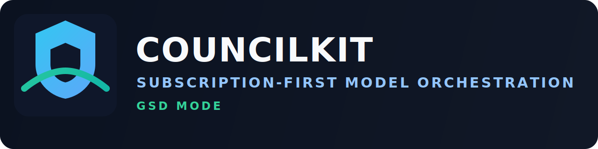

# councilkit



**CouncilKit is a local orchestration layer for model CLIs.**

> [!IMPORTANT]
> **Run Claude Code, Codex CLI, Gemini CLI, and optional community tools in parallel, then merge outputs into one structured result. No direct API calls are required in councilkit code.**

## Why This Is Useful

- **Use existing subscriptions**, not only API billing.
- **Split tasks by model strength** at the same time.
- **Get one shared output format** for agreement, disagreement, and next checks.
- **Keep data local by default** with on-disk run logs.

## What It Can Actually Do Today

- Claude Code plugin with `/councilkit:run` skill.
- Bundled MCP stdio server (`council-hub`) that auto-starts via `.mcp.json`.
- Primary MCP tool: `council_run`.
- Built-in workers: `codex`, `gemini`, `local`.
- Custom workers via settings (`antigravity`, `openclaw`, any local CLI wrapper).
- Parallel execution in `mode: "council"` or single worker execution in `mode: "single"`.

## IDE And Agent Compatibility

> [!TIP]
> **Yes: you can use this with Cursor and VS Code.**

- Claude Code: first-class plugin support in this repo.
- VS Code: template in [`integrations/vscode/mcp.json`](./integrations/vscode/mcp.json).
- Cursor: template in [`integrations/cursor/mcp.json`](./integrations/cursor/mcp.json).
- Windsurf: template in [`integrations/windsurf/mcp_config.json`](./integrations/windsurf/mcp_config.json).
- OpenClaw: dedicated loader guide in [`integrations/openclaw/README.md`](./integrations/openclaw/README.md).
- Zed, Neovim, JetBrains: templates/guides in [`integrations/`](./integrations/README.md).

## 60-Second Quickstart

> [!IMPORTANT]
> **Fast path:** `npm install` -> `npm run build` -> `npm run doctor` -> `claude --plugin-dir ./councilkit`

```bash
npm install
npm run build
npm run doctor
```

If doctor is clean, run:

```bash
claude --plugin-dir ./councilkit
```

Then use:

```text
/councilkit:run Implement feature X, have Codex propose code and Gemini review risks.
```

## Easy Setup For Cursor / VS Code

Use the provided MCP templates and point them to this repo's server:

```json
{
  "mcpServers": {
    "council-hub": {
      "command": "node",
      "args": ["/absolute/path/to/councilkit/dist/server.js"]
    }
  }
}
```

Templates:

- VS Code: [`integrations/vscode/mcp.json`](./integrations/vscode/mcp.json)
- Cursor: [`integrations/cursor/mcp.json`](./integrations/cursor/mcp.json)
- Windsurf: [`integrations/windsurf/mcp_config.json`](./integrations/windsurf/mcp_config.json)
- OpenClaw: [`integrations/openclaw/mcp-server-template.json`](./integrations/openclaw/mcp-server-template.json)

### OpenClaw Special Path

If you want OpenClaw specifically in the council, use either:

1. OpenClaw as a worker in `custom_workers` (immediate support).
2. Load `council-hub` as an MCP server in OpenClaw (if your OpenClaw host supports MCP server entries).

Reference: [`integrations/openclaw/README.md`](./integrations/openclaw/README.md)

## Worker Config (Subscription-First)

Edit [`councilkit.settings.json`](./councilkit.settings.json) or `~/.councilkit/config.json`.

```json
{
  "codex_command": "codex",
  "gemini_command": "gemini",
  "default_workers": ["codex", "gemini"],
  "custom_workers": {
    "antigravity": {
      "command": "antigravity run \"{task}\"",
      "output_format": "auto"
    },
    "openclaw": {
      "command": "openclaw \"{task}\"",
      "output_format": "auto"
    }
  }
}
```

## `council_run` Contract

Input:

```json
{
  "task": "string",
  "mode": "single | council",
  "workers": ["codex", "gemini", "local", "antigravity", "openclaw"],
  "output_format": "markdown | json"
}
```

Output includes:

- `results`
- `synthesis_inputs`
- `disagreements`
- `recommended_next_checks`

## Security And Legal Positioning

> [!WARNING]
> **CouncilKit is orchestration, not auth bypass.** It does not scrape tokens or replay OAuth sessions.

- No credential harvesting.
- No token scraping.
- No fake or replayed OAuth flows.
- Official CLIs are first-class; community tools are opt-in.
- See [`LEGAL_COMPLIANCE.md`](./LEGAL_COMPLIANCE.md) for policy and references.

## Commands

```bash
npm test
npm run build
npm run doctor
npm start
```

## Publishing Readiness

- Plugin manifest: [`.claude-plugin/plugin.json`](./.claude-plugin/plugin.json)
- MCP startup config: [`.mcp.json`](./.mcp.json)
- Skill prompt: [`skills/run/SKILL.md`](./skills/run/SKILL.md)
- CI: [`.github/workflows/ci.yml`](./.github/workflows/ci.yml)

## License

Apache-2.0. See [`LICENSE`](./LICENSE).
