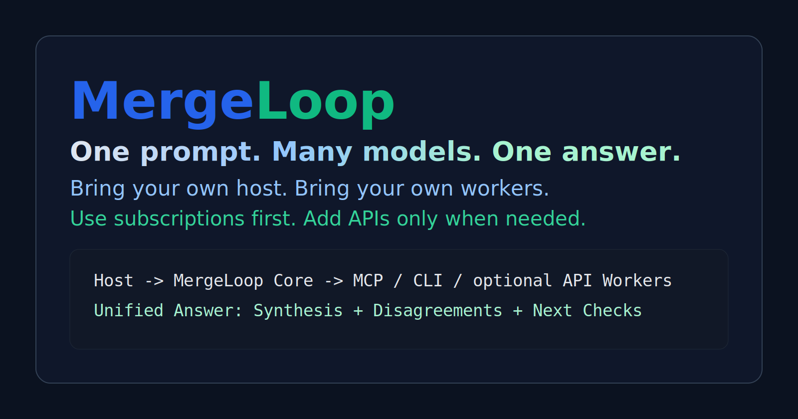
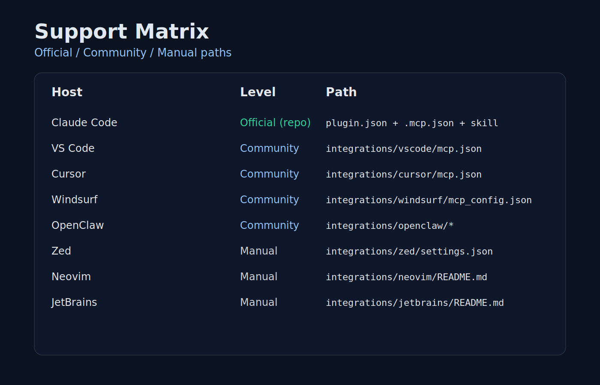

# councilkit



**One prompt. Many models. One answer.**

CouncilKit is an MCP-native model council for Claude Code, Codex, Gemini, and local workers.

**Use your subscriptions first. API optional.**

## Why This Exists

Most developers already pay for one or more model subscriptions, but still end up using one model at a time. CouncilKit gives you a local orchestration layer so you can run multiple model CLIs in parallel and synthesize one result with explicit agreement, disagreement, and recommended next checks.

## What It Does Today

- Runs as a bundled MCP stdio server (`council-hub`) plus Claude Code plugin assets.
- Exposes a single primary MCP tool: `council_run`.
- Supports `single` and `council` execution modes.
- Built-in workers: `codex`, `gemini`, `local`.
- Custom workers via config for community tools (for example OpenClaw/Antigravity wrappers).
- Persists run artifacts locally (`~/.councilkit/runs` by default).

## What It Does Not Do

- It does not mint extra vendor quota.
- It does not bypass vendor limits or authentication.
- It does not scrape tokens, cookies, or OAuth sessions.
- It does not claim first-party support for every host/editor.

## 30-Second Quickstart

```bash
npm ci
npm test
npm run build
npm run smoke
```

If using Claude Code:

```bash
claude --plugin-dir ./councilkit
```

## Quickstart By Platform

### Windows

```powershell
npm ci
npm run build
npm run doctor
```

Recommendation: for best CLI consistency, run in WSL when your worker toolchain is Linux-first.

### macOS / Linux

```bash
npm ci
npm run build
npm run doctor
```

## Claude Code Quickstart

1. Start Claude Code with this repo as plugin dir:
   `claude --plugin-dir ./councilkit`
2. Ensure plugin assets load:
   [`.claude-plugin/plugin.json`](./.claude-plugin/plugin.json),
   [`.mcp.json`](./.mcp.json),
   [`skills/run/SKILL.md`](./skills/run/SKILL.md).
3. Run `/councilkit:run` in Claude Code.

## Host Integrations

### VS Code

Use [`integrations/vscode/mcp.json`](./integrations/vscode/mcp.json) in your MCP client setup.

### Cursor

Use [`integrations/cursor/mcp.json`](./integrations/cursor/mcp.json).

### Windsurf

Use [`integrations/windsurf/mcp_config.json`](./integrations/windsurf/mcp_config.json).

### OpenClaw

Use [`integrations/openclaw/README.md`](./integrations/openclaw/README.md) for:
- OpenClaw as a CouncilKit worker (supported now).
- Loading CouncilKit MCP server from OpenClaw-compatible setups.

### Zed

Use [`integrations/zed/settings.json`](./integrations/zed/settings.json).

### Neovim

See [`integrations/neovim/README.md`](./integrations/neovim/README.md).

### JetBrains

See [`integrations/jetbrains/README.md`](./integrations/jetbrains/README.md).

## Supported Paths Matrix

| Host / Path | Support Level | Notes |
|---|---|---|
| Claude Code plugin path | **Official (in this repo)** | Primary packaged path |
| VS Code MCP template | Community | Depends on installed MCP-capable extension/client |
| Cursor MCP template | Community | Depends on Cursor MCP client behavior |
| Windsurf MCP template | Community | Depends on Windsurf MCP client behavior |
| OpenClaw worker + template | Community | OpenClaw version/config dependent |
| Zed / Neovim / JetBrains docs | Manual | User wires host plugin/settings |

## `council_run` Sample Request

```json
{
  "task": "Design a migration plan and list verification checks.",
  "mode": "council",
  "workers": ["codex", "gemini", "local"],
  "output_format": "json"
}
```

## Sample Merged Output (Shortened)

```json
{
  "results": [
    {"worker_name": "codex", "status": "success"},
    {"worker_name": "gemini", "status": "success"},
    {"worker_name": "local", "status": "success"}
  ],
  "synthesis_inputs": [
    {"worker_name": "codex", "summary": "Phased migration with test gates."},
    {"worker_name": "gemini", "summary": "Phased migration, stronger rollback notes."}
  ],
  "disagreements": [
    "gemini flagged operational risks not mentioned by codex"
  ],
  "recommended_next_checks": [
    "Run rollback drill in staging",
    "Validate data consistency with sampled checks"
  ]
}
```

## Why Not Just Use One Model?

Single-model workflows are faster for trivial tasks. Council mode is useful when you need:
- cross-checking and second opinions,
- explicit disagreement surfacing,
- stronger confidence before shipping high-impact changes.

## FAQ

### What happens if Claude is capped?

CouncilKit can still orchestrate workers in any host where `council-hub` is configured and the worker CLIs are available. If Claude Code usage is capped, you can still run the MCP server and use other clients/hosts. Host limits and vendor limits remain separate.

### Does this replace vendor auth?

No. Worker CLIs must be installed and authenticated separately.

### Does this create extra quota?

No. CouncilKit orchestrates existing tools; it does not add quota.

## Use Your Subscriptions First, API Optional

CouncilKit is built for local, subscription-first orchestration. If a team later wants API-based workers, that can be layered separately without changing the core local-first architecture.

## Security And Compliance

- No credential harvesting.
- No token scraping.
- No auth bypass behavior.
- Local run persistence is configurable.
- Community adapters are opt-in and should be reviewed before use.

Read:
- [SECURITY.md](./SECURITY.md)
- [LEGAL_COMPLIANCE.md](./LEGAL_COMPLIANCE.md)
- [docs/security.md](./docs/security.md)

## Limitations And Known Constraints

- Quality depends on installed worker CLIs and prompt quality.
- Different worker versions can produce inconsistent output formats.
- Some host integrations are template/manual, not first-party plugin integrations.
- `npm run doctor` reports missing CLIs when they are not installed, by design.

## Demo




Demo assets:
- [`docs/demo/README.md`](./docs/demo/README.md)
- [`docs/demo/storyboard/index.html`](./docs/demo/storyboard/index.html)

## Contributing And Roadmap

- Contribution guide: [CONTRIBUTING.md](./CONTRIBUTING.md)
- Roadmap: [ROADMAP.md](./ROADMAP.md)
- Changelog: [CHANGELOG.md](./CHANGELOG.md)
- Launch checklist: [docs/release-checklist.md](./docs/release-checklist.md)

## License

Apache-2.0. See [LICENSE](./LICENSE).
